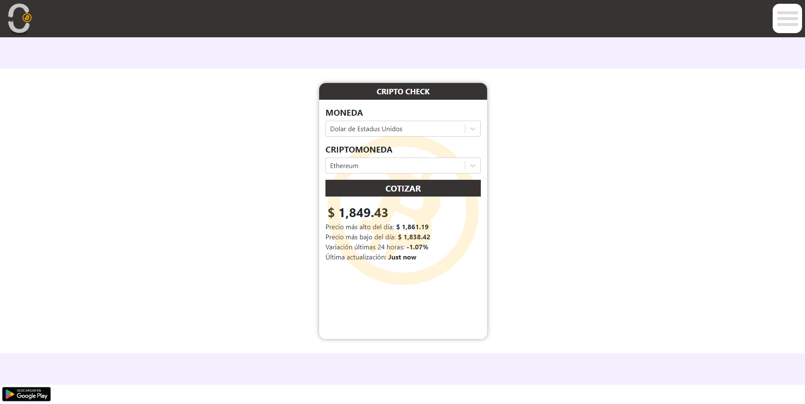

# App_Crypto_Web-
Versión web de la aplicación para consulta de valores de activos en monedas de diferentes países.

</img>
</img>
</img>

## Link Web
<a href="https://appcryptocheck.netlify.app/"></img></a>

## Descargar en PlayStore

<a href="https://play.google.com/store/apps/details?id=com.notjust.cryptocheck"></img></a>

